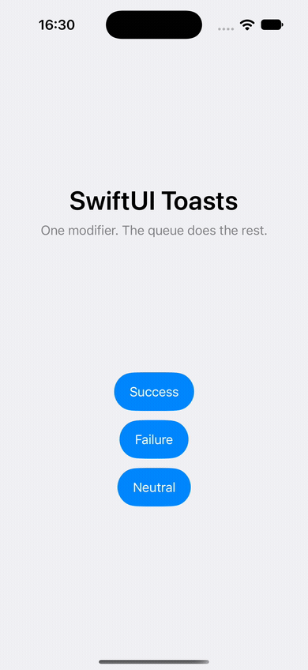
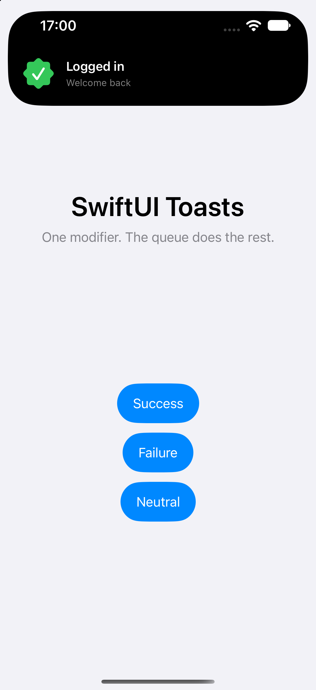
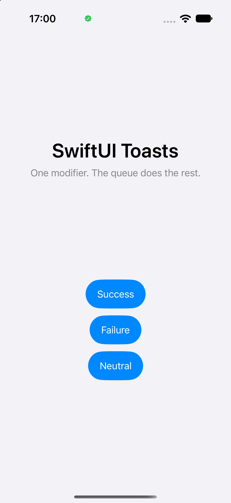
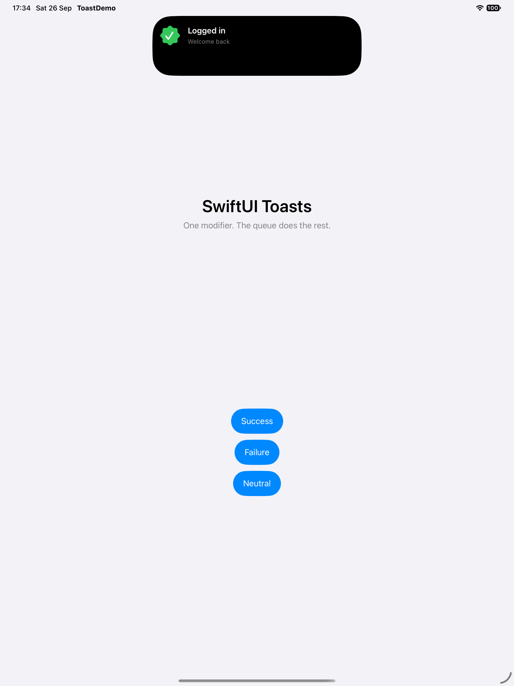
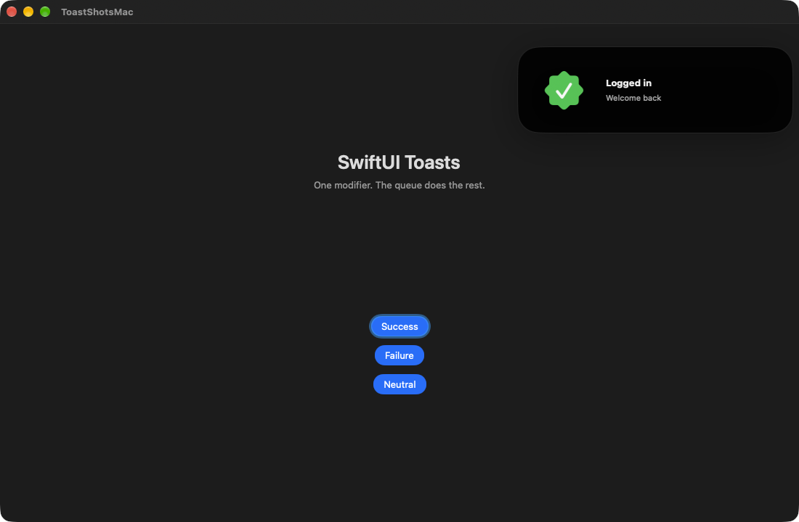
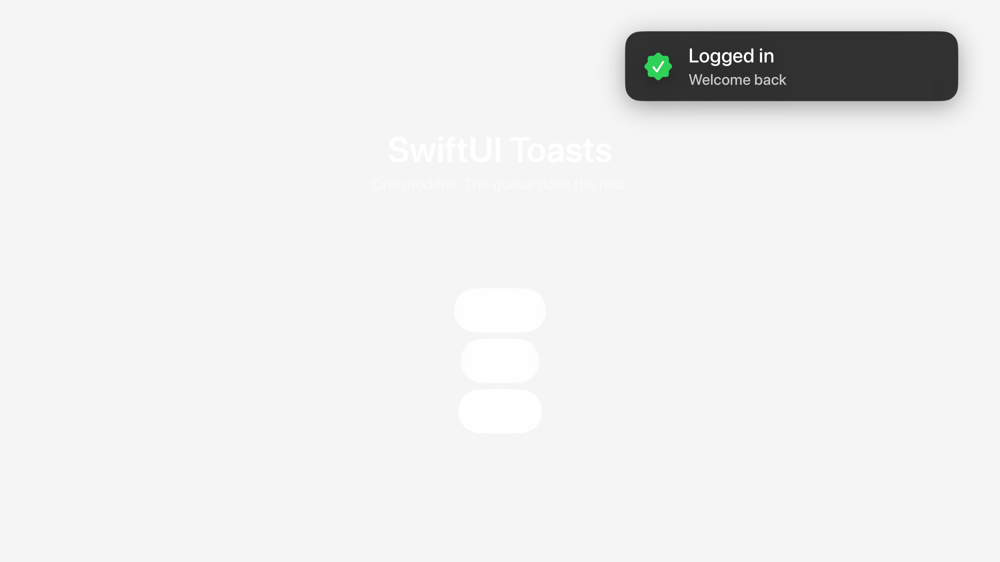

# SwiftUIToasts

One modifier, then `show`. The queue, timing, and animation stay inside the library.

On iPhone the toast is a system Live Activity when Live Activities are turned on and the app includes the widget below. Everywhere else, and whenever that request fails, the library draws the same card itself.

The in-app card, on an iPhone 17 Pro. It grows from the island. The title stays under the notch, then the card folds back to the symbol.



| Expanded from the island | Compact, symbol in the island |
| --- | --- |
|  |  |

## Add the package

```swift
dependencies: [
    .package(url: "https://github.com/mikolaj92/swiftui-toasts", branch: "main"),
],
targets: [
    .target(
        name: "YourApp",
        dependencies: ["SwiftUIToasts"]
    ),
]
```

In an Xcode app: File → Add Package Dependencies → `https://github.com/mikolaj92/swiftui-toasts`.

## Send a toast

Put the modifier on a parent of the views that send messages. Those views read the center from the environment.

```swift
import SwiftUI
import SwiftUIToasts

@main
struct YourApp: App {
    var body: some Scene {
        WindowGroup {
            HomeView()
                .dynamicIslandToasts()
        }
    }
}

struct HomeView: View {
    @Environment(IslandToastCenter.self) private var toasts

    var body: some View {
        Button("Log in") {
            toasts.show(
                title: "Logged in",
                message: "Welcome back",
                tone: .success
            )
        }
    }
}
```

Messages play one at a time, in the order they were sent. The card stays expanded for 2.2 seconds, folds for 1.4 seconds, then waits 1 second before the next one. Pass different durations to `.dynamicIslandToasts(expanded:compact:pause:)`.

Up to 10 messages can wait behind the one on screen. A later arrival is skipped when that line is full, and so is a repeat of a message already showing or already waiting.

iPad uses that same card, centered at the top, at phone width. On iPhone, success and failure play a short haptic.



On Mac the card sits in the upper-right corner of the window, below the title bar. It stays for the expanded time, then slides away.



Apple TV has no public API for an in-app banner. `UNNotificationPresentationOptionBanner` only presents a notification the system has already delivered, and showing one asks for notification permission. The library draws its own card in the upper-right corner, where a system banner sits, and keeps it out of the focus engine. The card stays for the expanded time, then slides away. There is no compact fold on Apple TV.



## System Dynamic Island

This part is optional. Without it, every toast uses the in-app card.

1. In the app target, set `NSSupportsLiveActivities` to `YES`.
2. Add a Widget Extension whose bundle returns ``IslandToastActivity``:

```swift
import SwiftUI
import SwiftUIToasts
import WidgetKit

@main
struct ToastsBundle: WidgetBundle {
    var body: some Widget {
        IslandToastActivity()
    }
}
```

`Examples/ToastDemo` is that setup, ready to open in Xcode. There is no permission prompt. The library only reads whether Live Activities are already enabled, asks the system to present one, and uses the in-app card if the system says no.
